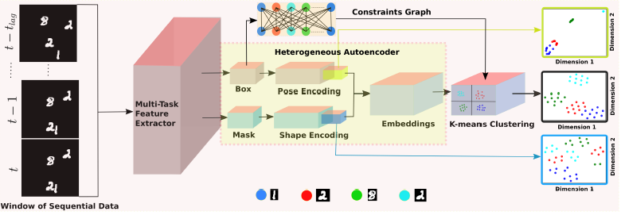

# USC_MOTS #

Unsupervised Spatio-temporal Latent Feature Clustering for Multiple-object Tracking and Segmentation. Accepted for BMVC 2021. Preprint available at ....

### This repository is for Unsupervised Spatio-temporal Latent Feature Clustering of multiple targets in a video segment ###

### Requirements: ###
* Python 3.7 
* Tensorflow-gpu 1.14
* Keras 2.3.1
* Pycocotools 2.0

### Installation ###

1. clone this repository and cd to root folder USC_MOTS
2. create a conda environment
```python
conda env create -f requirements.yml
```
3. download datasets<br />
To reproduce the synthetic MNIST-MOT or Sprites-MOT datasets, use [tracking-by-animation](https://github.com/zhen-he/tracking-by-animation.git) or 
```shell
python3 ./utils/gen_mnist.py --test 1
python3 ./utils/gen_sprite.py --test 1
```
Download the publicly available MOTS datasets from [MOTS](https://www.vision.rwth-aachen.de/page/mots) 
4. download pretrained models
5. download publicly available detections
6. To test the models
7. To train the models from scratch

### Contribution guidelines ###

* Writing tests
* Code review
* Other guidelines

### Who do I talk to? ###

* Repo owner or admin
* Other community or team contact
